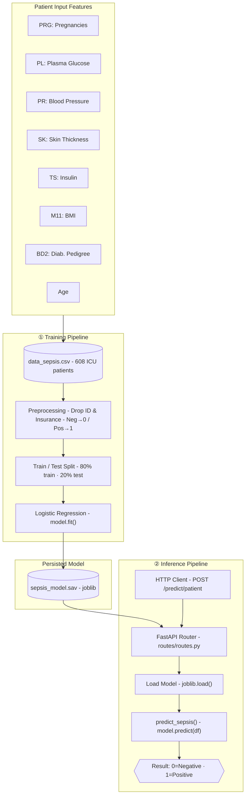
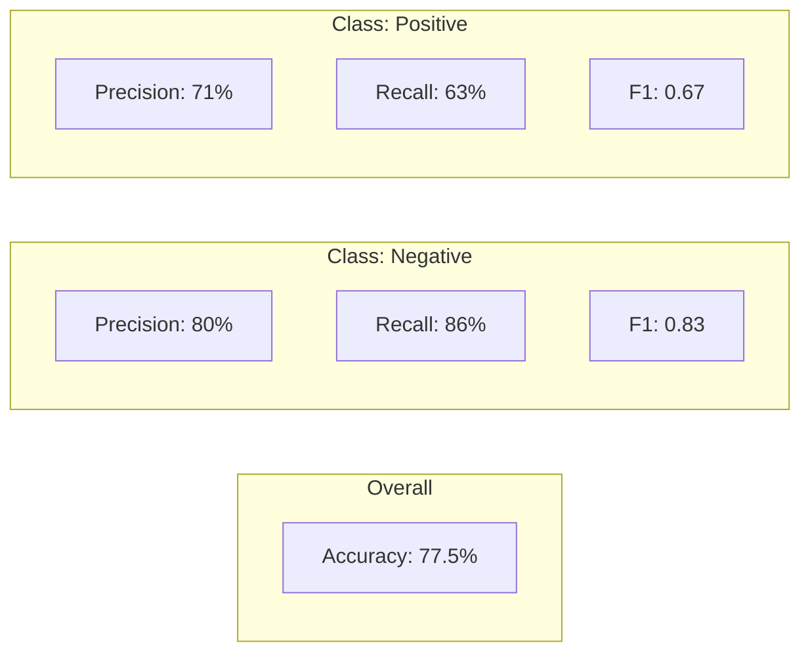

# MedTech Detect — Sepsis Prediction System

## Architecture



## Model Performance



> Test set: 120 patients (77 Negative · 43 Positive)

## File Map

```
MedTech_Detect/
├── main.py                    ← FastAPI app entry point
├── routes/routes.py           ← /health + /predict/patient endpoints
├── model/training_model.py    ← train + save + predict_sepsis()
├── parser/preprocessing.py    ← drop columns, encode target
├── data/data_sepsis.csv       ← 608 ICU patient records
└── model/sepsis_model.sav     ← saved logistic regression (joblib)
```
