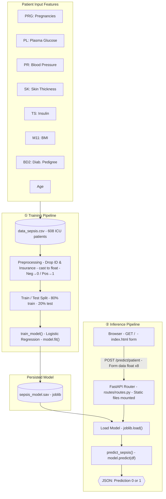
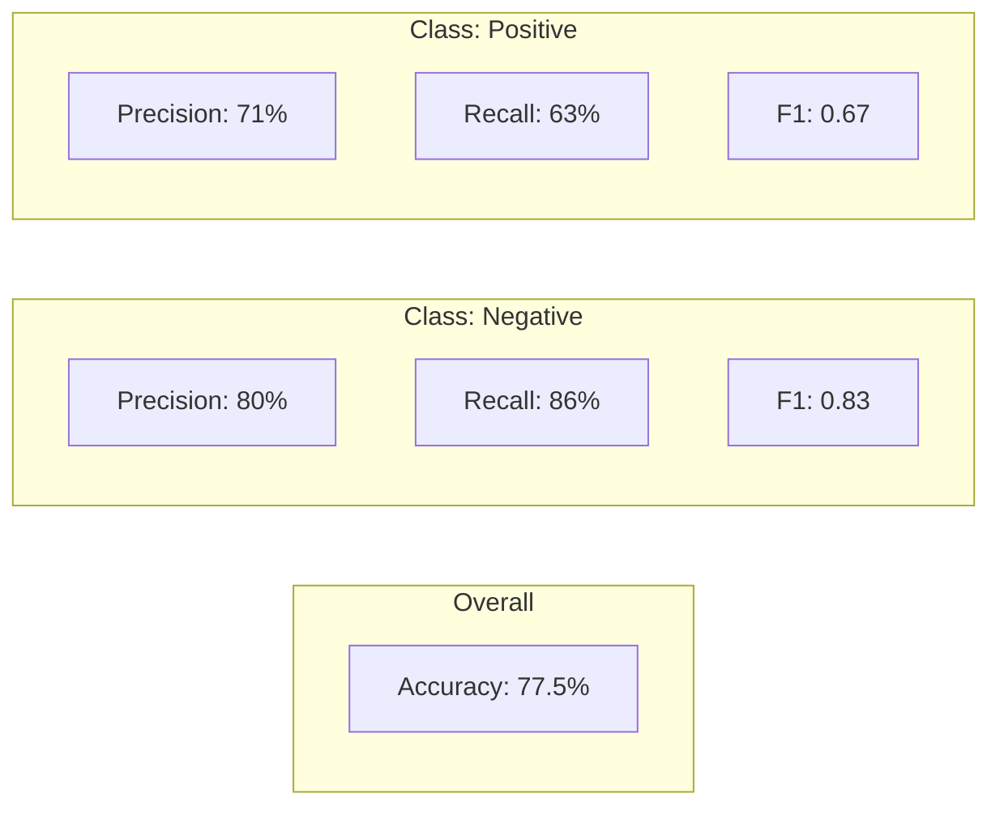

# MedTech Detect — Sepsis Prediction System

## Architecture



## Model Performance



> Test set: 120 patients (77 Negative · 43 Positive)

## Production Checklist

### Must-have

| Item | Status | Notes |
|------|--------|-------|
| Docker | ❌ | Containerize app for consistent deployment |
| Model loaded once at startup | ❌ | Currently `joblib.load()` runs on every request |
| Input validation | ❌ | No bounds checking — negative glucose, age=999 accepted |
| Error handling | ❌ | No handling for missing/malformed fields |
| HTTPS | ❌ | Required for medical data |

### Should-have

| Item | Status | Notes |
|------|--------|-------|
| Environment config | ❌ | Model path, host, port are hardcoded — use `.env` |
| Logging | ❌ | No request or prediction logging |
| Deep health check | ❌ | `/health` doesn't verify model is loaded |
| CI/CD | ❌ | Tests not wired to run automatically on push |

### Medical context

| Item | Status | Notes |
|------|--------|-------|
| Audit trail | ❌ | Who predicted what and when — regulatory requirement |
| Model versioning | ❌ | Track which model version made which prediction |
| Confidence score | ❌ | Return `predict_proba()` not just 0/1 — more useful clinically |

### Nice-to-have

| Item | Status | Notes |
|------|--------|-------|
| Rate limiting | ❌ | Prevent API abuse |
| Prediction drift monitoring | ❌ | Detect model decay over time |

---

## Cloud Deployment Option — Vertex AI (GCP)

Instead of self-hosting, Vertex AI covers most of the checklist above out of the box.

### How current components map to Vertex AI

| Current | Vertex AI equivalent |
|---------|---------------------|
| `sepsis_model.sav` (joblib) | **Model Registry** — versioned model storage |
| FastAPI `/predict/patient` | **Vertex AI Endpoint** — managed REST API, auto-scales |
| Manual retraining | **Vertex AI Pipelines** — scheduled or triggered retrains |
| No monitoring | **Model Monitoring** — automatic prediction drift detection |
| No audit trail | **Cloud Logging** — every prediction logged by default |
| No HTTPS / auth | **IAM + API Gateway** — built-in auth and HTTPS |

### Tradeoffs

| | DIY (current) | Vertex AI |
|--|---------------|-----------|
| Cost | Free if self-hosted | Pay per prediction + endpoint uptime |
| Control | Full | Limited to GCP interface |
| Setup effort | Already done | Migration needed |
| Scaling | Manual | Automatic |
| HIPAA compliance | You handle it | GCP covers it via BAA |

### Migration path

1. Export model — already done (`sepsis_model.sav` is joblib-compatible with Vertex)
2. Upload to **GCS bucket** → register in **Model Registry**
3. Deploy to a **Vertex Endpoint**
4. Update `routes/routes.py` to call the Vertex endpoint instead of `joblib.load()` locally
5. Set up **Vertex Pipelines** for retraining on new data

---

## File Map

```
MedTech_Detect/
├── main.py                    ← FastAPI app, mounts /static
├── routes/routes.py           ← GET / · GET /health · POST /predict/patient (Form)
├── model/training_model.py    ← train_model() · predict_sepsis()
├── parser/preprocessing.py    ← drop columns, cast to float, encode target
├── data/data_sepsis.csv       ← 608 ICU patient records
├── model/sepsis_model.sav     ← saved logistic regression (joblib)
├── static/style.css           ← frontend styles
├── static/script.js           ← frontend logic
├── templates/index.html       ← prediction form (Jinja2)
└── tests/                     ← app_test.py · routes_test.py
```
